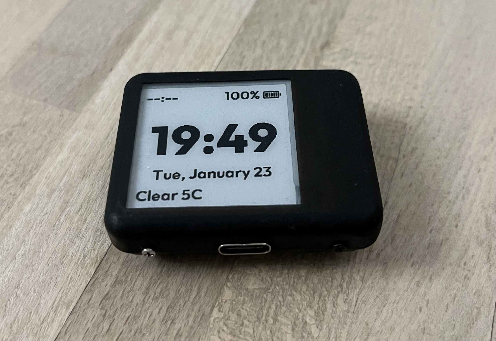

# lilygo-paper-watch
lily-paper-watch is a smartwatch firmware implementation for the LILYGO T-Wrist E-Paper ESP32 development board (https://github.com/Xinyuan-LilyGO/Wrist-E-Paper). This repositoy houses the source code along with 3D models and the FreeCAD file of the smartwatch case to make your very own qpaper!
This project is based upon qpaperOS by qewer33 (https://github.com/qewer33/qpaperOS)

## Features

The focus of this firmware is for a minimal and lightweight epaper smartwatch with maximum battery life.

The features that are implemented are:

- [x] Display time and date
- [x] Display battery percentage
- [x] Have the ESP32 MCU on deep sleep and wakeup every minute to update the display for power saving
- [x] Weather display
- [x] Focus Timer

As there is no buzzer on the LILYGO T-Wrist E-Paper ESP32 development board, the and timer app will not be able to make any sound.


Not planned features:

- Bluetooth
- GPS

The above a just power hungry features that are not necessary for a minimal smartwatch. If you want to add these features, you can fork this repository and add them yourself.

## The Product


More photos of the complete watch can be found under `assets/photos/` (https://github.com/z88kat/lilygo-paper-watch/tree/main/assets/photos)

qpaper is meant to be a minimal and lighweight smartwatch that does what it needs to do: always display time. The low power E-Paper screen of the qpaper allows it to always display the time and other information without having the display blank. The ESP32 wakes up every minute to update the display to show the correct time. More information about how the firmware works can be found in the next section.

The watch has a battery life of approx. ~3-4 days with a 250 mAh battery.

## Assembly

The outer sheell/case of the qpaper is meant to be 3D printed and assembled with 4 short M2 screws. The 3D models and FreeCAD file for the case can be found under `assets/3d/` (https://github.com/qewer33/qpaperOS/tree/main/assets/3d)

Required parts for assembly:
- LILYGO T-Wrist E-Paper ESP32 development board
    - https://www.lilygo.cc/products/t-wrist-e-paper-1-54-inch-display?variant=42405749948597 (Note: you need to buy the non GPS version if you don't have a LILYGO T-U2T, buy a version with T-U2T bundled. You *need* T-U2T to program the board!)
- 3D printed "Shell" piece
- 3D printed "Bottom Plate" piece
- 3D printed "Buttons" piece
- 250 mAh 1S lipo battery
- 4x short M2/M1.6/M1.4 screws
- 22mm watch strap (compatible with Huawei GT2/GT3 straps)

## Uploading the firmware

Clone this git repository and open it in VSCode. Make sure you have the PlatformIO extension installed. Connect the USB-C cable to your computer and to the T-U2T. Connect the T-U2T to the watch and click the "PlatformIO: Upload" button in the status bar.

## Connecting the watch to WiFi

Set the WiFi SSID and password in `src/os_config.h` and upload the firmware.


## Pre Commit Hook

If you enter your WiFi password in the os_config.h there is a got chance that you do not want to check this into your repository. Solution: Use the pre-commit hook to abort commiting.

```
cp hooks/pre-commit .git/hooks/pre-commit
chmod u+x .git/hooks/pre-commit
```

## The Firmware

qpaperOS is the firmware part of the qpaper project. It is developed to work with the LILYGO T-Wrist E-Paper ESP32 development board. It uses the espressif-esp32-arduino framework and PlatformIO for development.


## Focus Timer

The focus timer is a simple timer that counts down from 25 minutes. It is meant to be used for the Pomodoro Technique (https://en.wikipedia.org/wiki/Pomodoro_Technique). The timer will vibrate when the time is up.

*Using the Timer*:

* Press the user button (top right) once to start the timer for 25 minutes.
* Double press the user button to start the timer for 5 minutes.
* Long press the user button to reset / stop the timer.

## Deep Sleep

The ESP32 is put into deep sleep mode to save power. The ESP32 will wake up every minute to update the display and then go back to sleep. The ESP32 will also wake up when the user button is pressed.  The deep sleep makes starting and using the timer a bit akward as the ESP32 needs to wake up first. But that's the price we pay to keep the device as power efficient as possible.

## Battery Life

The battery life of the qpaper is approx. 3-4 days with a 250 mAh battery. In order to achieve this I needed to perform to refresh the display using updateWindows which causes a few graphical glitches. The glitches are not that bad and I think it is a good tradeoff for a longer battery life.  If you don't like it, just comment back in the display.update() in wakeup.cpp.

The battery life can be extended by using a bigger battery. The battery life can be extended even further by disabling the WiFi connection in `src/os_config.h`. This will disable the NTP time sync and weather display.

## Weather Display

The weather display is implemented using the OpenWeatherMap API (https://openweathermap.org/api). You need to create an account and get an API key. The API key needs to be entered in `src/os_config.h`. The weather display will be disabled when the key is not defined by `#define WEATHER_API_KEY` in `src/os_config.h`.

You location can be set by entering your address in `src/os_config.h` in the `WEATHER_LOCATION` variable. Enter City, Country. For example: `#define WEATHER_LOCATION "Amsterdam,NL"`